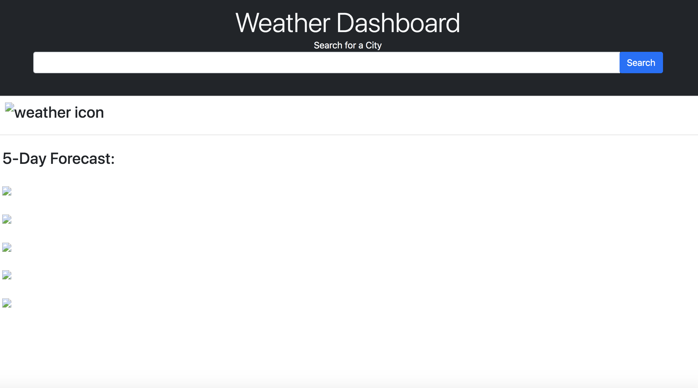

# weather-dashboard

## Description
This application utilizes third party API's to create a weather dashboard with form inputs. The user can search for a city with current and future conditions( 5 day forecast) for that city. The app will display the temperature, an icon of the weather, and the uv index of that particular city.

USER STORY
* AS A traveler
* I WANT to see the weather outlook for multiple cities
* SO THAT I can plan a trip accordingly

The application will utilize HTML, CSS, Javascript and a Readme file.

